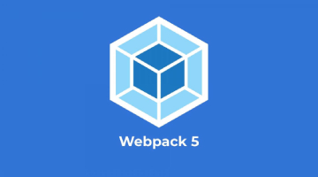

 
 

  

<h2 align="center">Webpack Production Optimization Testing</h2>
  

    This repository is for testing purposes following a course. Focused in understand how webpack works and how to implement their plugins and loaders in a real world application. Here's some of the implemented functionalities:
  

  

  <li>Code splitting</li>
  <li>Minimizing</li>
  <li>Multiple CSS platforms</li>
  <li>Bundle Analyzer</li>
  

     
     
    <a href="https://www.udemy.com/course/webpack-optimizing-for-production"><strong>Watch the course »</strong></a>
     
     
    <a href="https://br.linkedin.com/in/matheus-alvarenga-de-oliveira">My LinkedIn Profile</a>
    ·
    <a href="https://github.com/matheusAlvarenga">My Github Profile</a>

